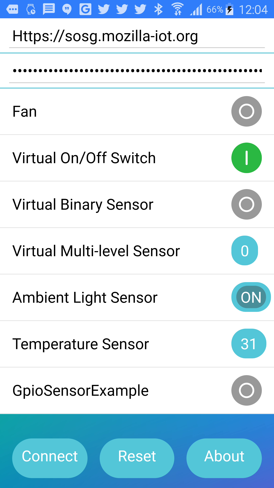

## WEBTHINGS WEBAPP: ##

Standalone application to browse "Webthings" connected to "Mozilla IoT Gateway"

* URL: https://github.com/rzr/webthings-webapp

[](https://GitHub.com/rzr/webthings-webapp/network/)


## USAGE: ##

Setup "Mozilla IoT gateway", create default user.

This "webapp" was originally designed to be used into Tizen HTML5 runtime environment,
then ported as "Progressive Web App" for Samsung Internet browser (on android device).

[](https://s-opensource.org/2018/06/21/webthing-iotjs/ "Demo")

Also, page can also be tested also using regular browser (as long as CORS is enabled),
using a remote URL (ie: https://rzr.github.io/webthings-webapp/ )
or just load index.html from filesystem (using file:/// protocol).

```
rm -rf tmp
mkdir -p tmp
chromium-browser --disable-web-security --user-data-dir="tmp" https://rzr.github.io/webthings-webapp/
```

Then update gateway's URL:
* http://gateway.local:8080 : for default location in local network
* https://$host.mozilla-iot.org : for public (if you haven't skipped the registation step)

For debuging purposes here are various snapshot of the app:

* https://rzr.github.io/webthings-webapp/
* https://tizenteam.github.io/webthings-webapp/
* https://tizenteam.github.io

For reference, It was tested on Tizen TM1 reference device.

## DEMO: ##

[](https://www.slideshare.net/SamsungOSG/the-complex-iot-equation-and-floss-solutions-101449596/10 "Demo video")

* https://www.slideshare.net/SamsungOSG/the-complex-iot-equation-and-floss-solutions-101449596/


## RESOURCES: ##

* https://iot.mozilla.org/
* https://s-opensource.org/category/internet-of-things/
* https://en.wikipedia.org/wiki/Cross-origin_resource_sharing
* https://wiki.tizen.org/TM1
* https://wiki.tizen.org/index.php?title=User:Pcoval
